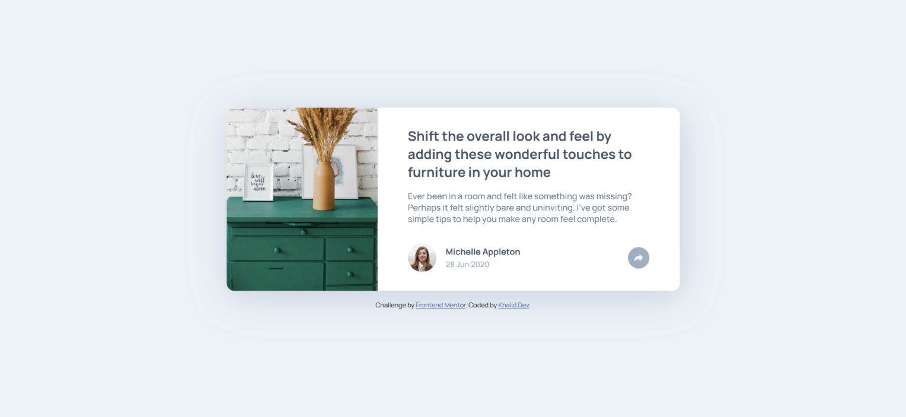

# Frontend Mentor - Article preview component solution

This is a solution to the [Article preview component challenge on Frontend Mentor](https://www.frontendmentor.io/challenges/article-preview-component-dYBN_pYFT). Frontend Mentor challenges help you improve your coding skills by building realistic projects.

## Table of contents

- [Overview](#overview)
  - [Screenshot](#screenshot)
  - [Links](#links)
- [My process](#my-process)
  - [Built with](#built-with)
  - [Continued development](#continued-development)
  - [Useful resources](#useful-resources)
- [Author](#author)

## Overview

This project, Article Preview Component Solution, demonstrates the creation of a reusable component for displaying article previews. It utilizes HTML for structure, CSS for styling, and JavaScript for interactivity. This component aims to provide a visually appealing and informative way to showcase multiple articles on a webpage.

### Screenshot

### Links

- Solution URL: [article-preview-component-master](https://github.com/5alidev/FrontEnd_Dev/tree/main/article-preview-component-master)
- Live Site URL: [Article Preview Component Master](https://fourcardsectionfm.netlify.app/)

## My process

### Built with

- Semantic HTML5 markup
- CSS custom properties
- Flexbox
- Mobile-first workflow

### Continued development

The Article Preview Component Solution offers a strong foundation, but there's room for further exploration:

- Data Integration: Explore integrating the component with a backend system or API to dynamically populate article data, making it easier to manage and display large amounts of content.
- Customization Options: Implement options to customize the component's appearance (e.g., font styles, color schemes, image sizes) to better match different website designs. This could be achieved with CSS variables or preprocessor features.

### Useful resources

- [Trusted Hosting Providers](https://medium.com/frontend-mentor/frontend-mentor-trusted-hosting-providers-bf000dfebe) - This article helped me discover reliable free hosting providers for my projects.

## Author

- Frontend Mentor - [@5alidev](https://www.frontendmentor.io/profile/5alidev)
- Twitter - [@Khalid\_\_Dev](https://www.twitter.com/Khalid__Dev)
