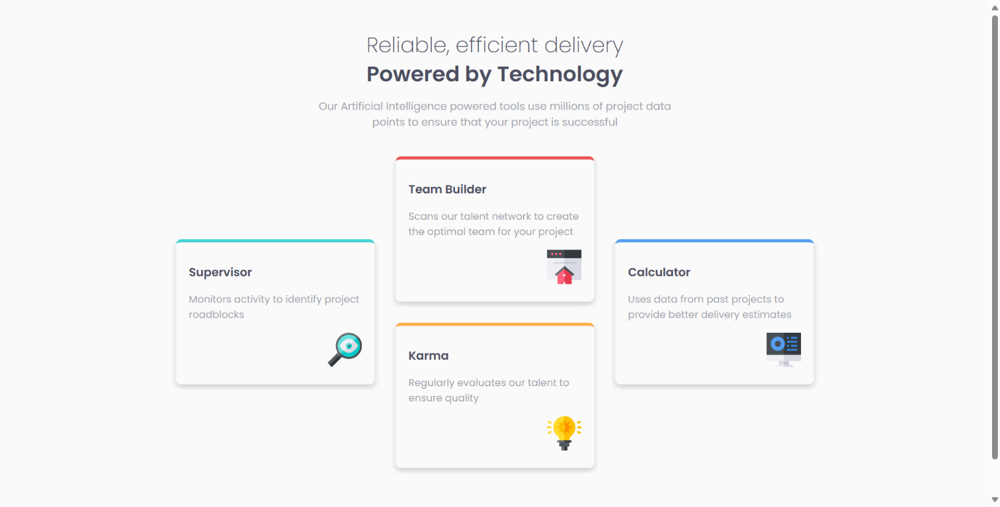

# Frontend Mentor - Four card feature section solution

This is a solution to the [Four card feature section challenge on Frontend Mentor](https://www.frontendmentor.io/challenges/four-card-feature-section-weK1eFYK). Frontend Mentor challenges help you improve your coding skills by building realistic projects.

## Table of contents

- [Overview](#overview)
  - [Screenshot](#screenshot)
  - [Links](#links)
- [My process](#my-process)
  - [Built with](#built-with)
  - [Continued development](#continued-development)
  - [Useful resources](#useful-resources)
- [Author](#author)

## Overview

This project, four-card-feature-section, is a responsive web page showcasing four key features in a card layout. It utilizes HTML and CSS to create a visually appealing and informative section that adapts to different screen sizes.

### Screenshot

### Links

- Solution URL: [four-card-feature-section-master](https://github.com/5alidev/FrontEnd_Dev/tree/main/four-card-feature-section-master)
- Live Site URL: [Four card feature section](https://fourcardsectionfm.netlify.app/)

## My process

### Built with

- Semantic HTML5 markup
- CSS custom properties
- Flexbox
- Desktop-first workflow

### Continued development

This section is currently functional, but there's always room for improvement! Here are some potential future additions:

- Interactive elements: Consider adding hover effects, animations, or micro-interactions to the cards for a more engaging user experience.
- Additional features: You could expand the layout to showcase more than four features or allow for customization options.
- Advanced styling: Explore incorporating CSS frameworks or preprocessors for a more robust and maintainable codebase.

### Useful resources

- [Trusted Hosting Providers](https://medium.com/frontend-mentor/frontend-mentor-trusted-hosting-providers-bf000dfebe) - This article helped me discover reliable free hosting providers for my projects.

## Author

- Frontend Mentor - [@5alidev](https://www.frontendmentor.io/profile/5alidev)
- Twitter - [@Khalid\_\_Dev](https://www.twitter.com/Khalid__Dev)
