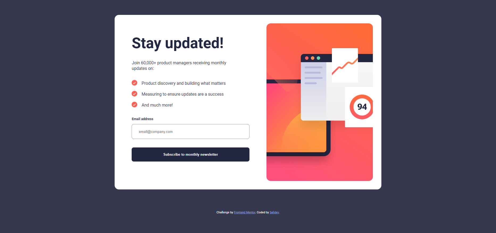

# Frontend Mentor - Article preview component solution

This is a solution to the [Newsletter sign-up form with success message challenge on Frontend Mentor](https://www.frontendmentor.io/challenges/newsletter-signup-form-with-success-message-3FC1AZbNrv). Frontend Mentor challenges help you improve your coding skills by building realistic projects.

## Table of contents

- [Overview](#overview)
  - [Screenshot](#screenshot)
  - [Links](#links)
- [My process](#my-process)
  - [Built with](#built-with)
  - [Continued development](#continued-development)
  - [Useful resources](#useful-resources)
- [Author](#author)

## Overview

This project involves creating a responsive newsletter sign-up form. The form should validate user email input using JavaScript. Upon successful submission, a success message should be displayed. If validation fails, an error message should be shown. The project utilizes HTML, CSS, and JavaScript to achieve these functionalities.

### Screenshot

### Links

- Solution URL: [newsletter-sign-up-with-success-message](https://github.com/5alidev/FrontEnd_Dev/tree/main/article-preview-component-master)
- Live Site URL: [Newsletter Sign Up With Seuccess Message](https://fourcardsectionfm.netlify.app/)

## My process

### Built with

- Semantic HTML5 markup
- CSS custom properties
- Flexbox
- Mobile-first workflow

### Continued development

As I continue to develop this project, I can focus on the following enhancements:

- Improving accessibility: Ensuring the form adheres to WCAG guidelines for users with disabilities.
- Providing more helpful error messages: Giving users clear guidance on how to correct their input.
- Integrating with a backend service: Connecting the form to a server to handle email submissions and store user data.

### Useful resources

- [Trusted Hosting Providers](https://medium.com/frontend-mentor/frontend-mentor-trusted-hosting-providers-bf000dfebe) - This article helped me discover reliable free hosting providers for my projects.

## Author

- Frontend Mentor - [@5alidev](https://www.frontendmentor.io/profile/5alidev)
- Twitter - [@Khalid\_\_Dev](https://www.twitter.com/Khalid__Dev)
