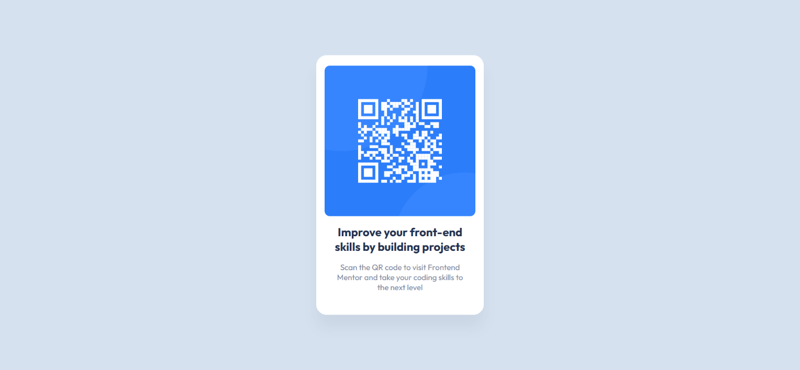

# Frontend Mentor - QR code component solution

This is a solution to the [QR code component challenge on Frontend Mentor](https://www.frontendmentor.io/challenges/qr-code-component-iux_sIO_H). Frontend Mentor challenges help you improve your coding skills by building realistic projects.

## Table of contents

- [Overview](#overview)
  - [Screenshot](#screenshot)
  - [Links](#links)
- [My process](#my-process)
  - [Built with](#built-with)
  - [Continued development](#continued-development)
  - [Useful resources](#useful-resources)
- [Author](#author)

## Overview

The "QR Code Component" project offers a simple HTML-based solution for displaying QR codes within web applications.

### Screenshot

### Links

- Solution URL: [QR Code Card](https://www.frontendmentor.io/solutions/qr-code-card-TT5sYBXpvU)
- Live Site URL: [QR Code Card](https://qr-code-card-roan-xi.vercel.app/)

## My process

### Built with

- Semantic HTML5 markup
- CSS custom properties
- Flexbox
- Desktop-first workflow

### Continued development

In future projects, I aim to further refine the responsiveness of my designs by testing on a wider range of devices and optimizing layouts for specific screen sizes. Additionally, I plan to explore advanced CSS techniques such as animations and transitions to enhance the visual appeal of my projects. I also intend to introduce JavaScript functionality to add interactivity and dynamic content. Furthermore, I aim to deepen my understanding of accessibility principles and techniques, ensuring that my projects are inclusive and accessible to all users. Finally, I plan to explore the integration of build tools and frameworks to streamline my development workflow and enhance project scalability.

### Useful resources

- [Trusted Hosting Providers](https://medium.com/frontend-mentor/frontend-mentor-trusted-hosting-providers-bf000dfebe) - This article helped me discover reliable free hosting providers for my projects.

## Author

- Frontend Mentor - [@5alidev](https://www.frontendmentor.io/profile/5alidev)
- Twitter - [@Khalid\_\_Dev](https://www.twitter.com/Khalid__Dev)
