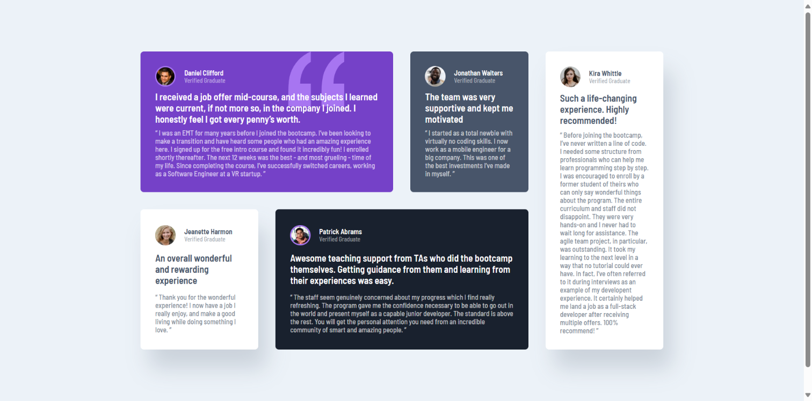

# Frontend Mentor - Testimonials grid section solution

This is a solution to the [Testimonials grid section challenge on Frontend Mentor](https://www.frontendmentor.io/challenges/testimonials-grid-section-Nnw6J7Un7). Frontend Mentor challenges help you improve your coding skills by building realistic projects.

## Table of contents

- [Overview](#overview)
  - [Screenshot](#screenshot)
  - [Links](#links)
- [My process](#my-process)
  - [Built with](#built-with)
  - [Continued development](#continued-development)
  - [Useful resources](#useful-resources)
- [Author](#author)

## Overview

This project, Testimonials Grid Section, is a reusable component for displaying testimonials in a clean and responsive grid layout. It utilizes HTML and CSS to create a visually appealing and trustworthy section that adapts to various screen sizes, showcasing positive feedback from your users.

### Screenshot

### Links

- Solution URL: [testimonials-grid-section-main](https://github.com/5alidev/FrontEnd_Dev/tree/main/testimonials-grid-section-main)
- Live Site URL: [Testimonials Grid Section](https://fourcardsectionfm.netlify.app/)

## My process

### Built with

- Semantic HTML5 markup
- CSS custom properties
- Flexbox
- Desktop-first workflow

### Continued development

This testimonials grid section provides a solid foundation, but there's room for further enhancement:

- Customization Options: Explore adding options to customize the grid layout (e.g., number of columns, spacing), typography styles, and potentially even hover effects for a more tailored user experience.
- Integration with Data Sources: Consider integrating this component with a backend system or CMS to pull testimonials dynamically, making it easier to manage and update content.

### Useful resources

- [Trusted Hosting Providers](https://medium.com/frontend-mentor/frontend-mentor-trusted-hosting-providers-bf000dfebe) - This article helped me discover reliable free hosting providers for my projects.

## Author

- Frontend Mentor - [@5alidev](https://www.frontendmentor.io/profile/5alidev)
- Twitter - [@Khalid\_\_Dev](https://www.twitter.com/Khalid__Dev)
